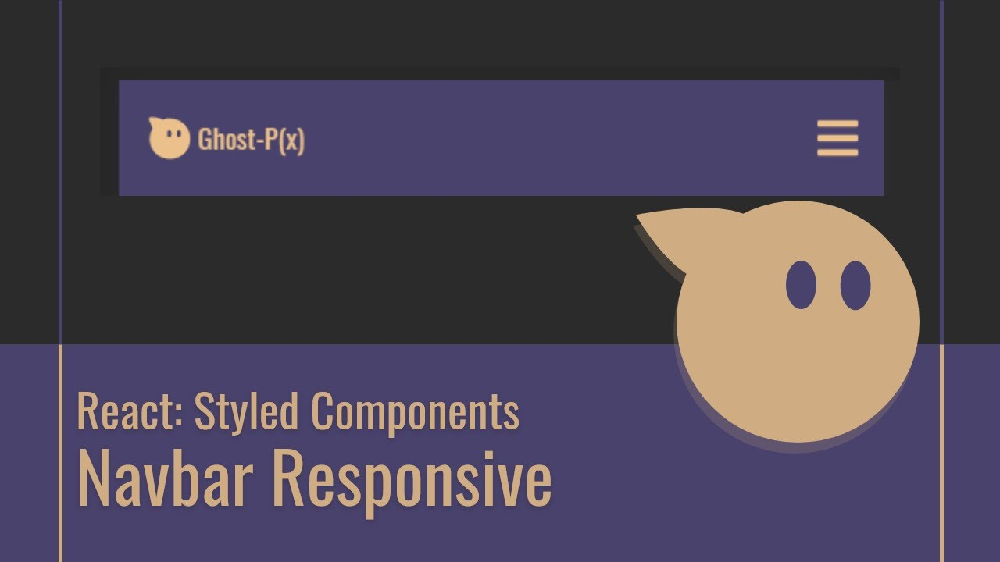

# Navbar Responsivo con React y Styled-Components

### `npm install`

No te olvides de aplicar el comando npm install cuando descarges el proyecto, esto para descargar todas las dependencias necesarias: styled-components, react-icons
Suerte!!!

## Tutorial 
https://youtu.be/pT0IiZtX-w0

## Preview 

